# studio2201

[](https://github.com/studio2201/studio2201/actions/workflows/ci.yml)
[](https://github.com/studio2201/studio2201/releases)
[](LICENSE)
[](https://studio2201.com)
[](https://studio2201.com)

Working doctrine and parent framework for the studio2201 ecosystem.

## Five Products & Tool Status

| Product | Focus | Tool-Specific Badge | Action / CI | Version |
| :--- | :--- | :--- | :--- | :--- |
| [**Vigil**](vigil/) | Supply-chain dormancy scanner | [](vigil/) | [](vigil/) | `v0.2.4` |
| [**Snip**](snip/) | Vibe-code security gate | [](snip/) | [](snip/) | `v0.2.4` |
| [**Boneyard**](boneyard/) | Org-wide tech-debt radar | [](boneyard/) | [](boneyard/) | `v0.2.4` |
| [**Aegis**](aegis/) | PQC migration SDK & scanner | [](aegis/) | [](aegis/) | `v0.2.4` |
| [**Proven**](proven/) | PQC-signed supply-chain attestor | [](proven/) | [](proven/) | `v0.2.4` |

## Core Doctrine

| File | Purpose |
|---|---|
| `RULES.md` | Immutable engineering rules |
| `OODA.md` | Observe → Decide → Act → Lock → Ship workflow |
| `PROBE.md` | Security testing checklist |
| `SWARM.md` | Multi-agent coordination |
| `DESIGN.md` | Product design principles |

**Storefront & Documentation:** https://studio2201.com

## Installation

```bash
# Install all five tools via universal installer:
curl -fsSL https://studio2201.com/install.sh | sh -s all
```

---

<div align="center">

[](https://necrometer.dev/?u=studio2201)

</div>
